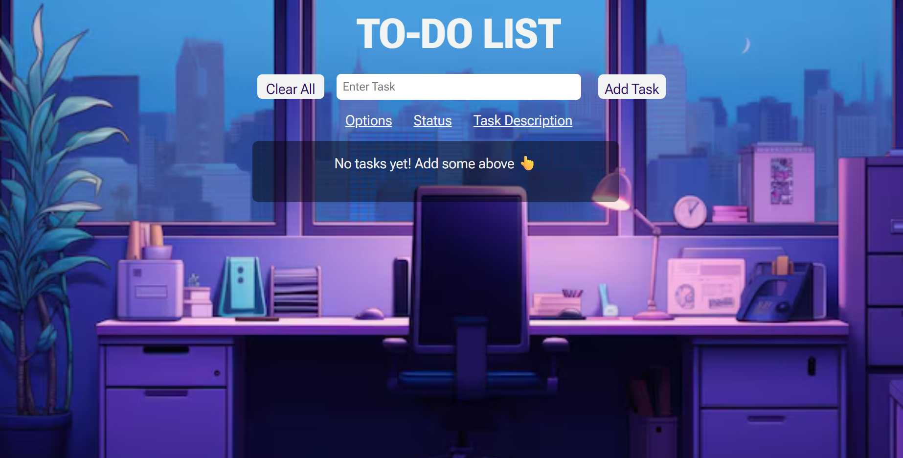
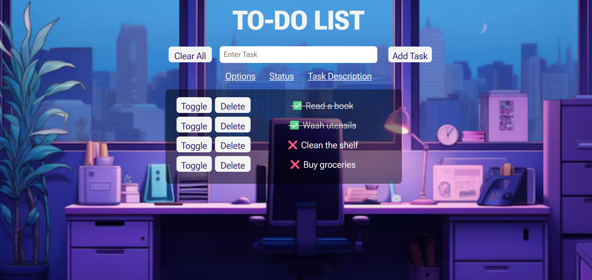

# 📝 To-Do App v2

A clean, responsive, and persistent to-do list web app built with **HTML**, **CSS**, and **JavaScript**. Tasks are saved using `localStorage`, so your list stays intact even after refreshing the page.

---

## 🔗 Live Demo

👉 [Click here to view the live app](https://erleen0307.github.io/to-do-app-v2/)  

---

## 📸 Preview

 

 

---

## 🚀 Features

- ✅ Add, toggle, and delete tasks
- 💾 Automatically saves to localStorage
- 🧹 Clear all tasks with one click
- ✍️ Strikethrough for completed items
- 📱 Responsive design (mobile-friendly)
- 🎨 Stylish UI with background image and glass-effect panel
- 🖥️ Built with object-oriented JavaScript (OOP)

---

## 💡 Tech Stack

- HTML5
- CSS3
- JavaScript (ES6+)
- LocalStorage API

---

## 📁 Folder Structure

```
to-do-app-v2/
│
├── index.html         # Main HTML file
├── style.css          # Styling and layout
├── script.js          # App logic and localStorage handling
├── bg.jpg             # Background image
└── screenshot.png     # Optional: Project preview screenshot
```

---

## 🛠️ How to Run Locally

1. Clone this repo:
   ```bash
   git clone https://github.com/yourusername/to-do-app-v2.git
   ```

2. Open `index.html` in your browser — that’s it!

---

## 🙋‍♂️ Author

### 📅 Date Completed: June 26, 2025
**Built with love by [erleen0307](https://github.com/erleen0307)**  

---

## 🪪 License

This project is open source and free to use for learning and showcasing.
